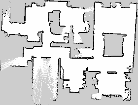
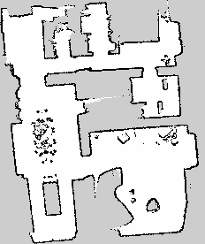
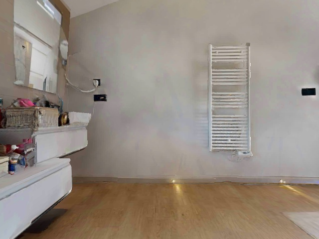
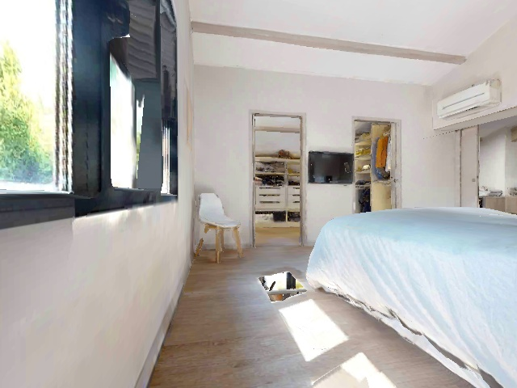
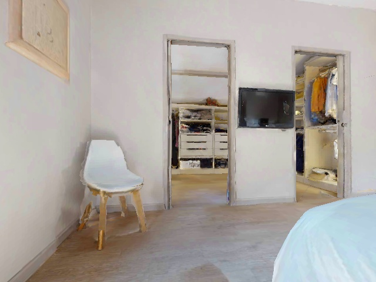

# TurtleBot Autonomous Navigation with Landmark Detection

A full-stack autonomous indoor navigation system on TurtleBot, integrating
SLAM, YOLO-based landmark detection, multi-floor map management, and
voice/text command interfaces -- built on ROS.


## Demo

Multi-floor SLAM maps generated during autonomous exploration:

| Upstairs | Downstairs |
|---|---|
|  |  |

Robot's-eye view during a capture run:

| | | |
|---|---|---|
|  |  |  |


## What it does

- Real-time landmark detection using YOLOv5 over a ROS image pipeline,
  identifying objects and logging their coordinates via TF lookup
  (camera detection -> robot pose in the map frame -> saved landmark)
- Multi-floor map support: separate 2D occupancy maps per floor
  (downstairs, floor2, upstairs) with automated switching and
  persistent localization via AMCL
- Voice and typed command interfaces: say or type a landmark name and
  the robot autonomously navigates there via move_base
- YAML-based landmark storage, decoupling perception from navigation
- Frontier-based autonomous exploration and SLAM mapping (slam_toolbox,
  rf2o_laser_odometry, explore_lite)
- Habitat-Sim integration for photorealistic simulation testing
- ~95% system accuracy demonstrated in controlled indoor testing

## Repository Structure

```
├── launch/                        Top-level autonomous nav + voice/text launch files
├── landmark_detection/            YOLO detection, landmark storage, and navigation
│   ├── yolo_run.py                 YOLOv5 detector -> landmark coordinate logger
│   ├── landmark_saver.py           Persists detected landmarks to YAML
│   ├── voice_command_navigator.py  Voice-controlled "go to <landmark>" interface
│   ├── typed_command_navigator.py  Typed-command equivalent
│   ├── image_capture_and_pose_logger.py  Captures frames + robot pose
│   ├── controller_node.py          Robot motion controller
│   ├── auto_landmark.py / landmark_navigator.py / navigate_to_landmark.py
│   │                                Landmark navigation helpers
│   ├── speech_recognition_node.py  Speech-to-text front end
│   ├── voice_map_switcher.py       Multi-floor map switching by voice
│   └── launch/
│       ├── locate.launch           Bring up AMCL + landmark navigator (voice/typed)
│       ├── object_detection.launch Bring up YOLO detection pipeline
│       ├── landmark_capture.launch Capture + log landmarks during exploration
│       └── my_amcl.launch          AMCL localization
├── landmarks/                     Persisted landmark name -> coordinates (YAML)
├── maps/                          Generated occupancy grid maps (multiple floors)
├── data/                          Sample captured frames + pose CSV
├── docs/media/                    Map screenshot + demo video
└── src/                           Habitat-Sim <-> ROS bridge and other custom nodes
```

## Dependencies

| Package | Purpose | Install |
|---|---|---|
| ROS Noetic + navigation | move_base, AMCL, costmap_2d | `sudo apt install ros-noetic-navigation` |
| turtlebot3, turtlebot3_msgs, turtlebot3_simulations | Robot driver + Gazebo models | `sudo apt install ros-noetic-turtlebot3*` |
| slam_toolbox | SLAM mapping | `sudo apt install ros-noetic-slam-toolbox` |
| rf2o_laser_odometry | Laser-based odometry | build from source |
| m-explore (explore_lite) | Frontier exploration | https://github.com/hrnr/m-explore |
| PyTorch + YOLOv5 (`ultralytics/yolov5` via torch.hub) | Object detection | `pip install torch torchvision` |
| cv_bridge, OpenCV | ROS <-> OpenCV image conversion | `sudo apt install ros-noetic-cv-bridge ros-noetic-vision-opencv` |
| SpeechRecognition (Python) | Voice command input | `pip install SpeechRecognition` |
| Habitat-Sim | Photorealistic simulator | https://github.com/facebookresearch/habitat-sim |

## Installation

```bash
mkdir -p ~/catkin_ws/src && cd ~/catkin_ws/src
git clone https://github.com/David-Lee27/turtlebot-autonomous-navigation.git

sudo apt install ros-noetic-navigation ros-noetic-turtlebot3 \
                  ros-noetic-turtlebot3-msgs ros-noetic-turtlebot3-simulations \
                  ros-noetic-cv-bridge ros-noetic-vision-opencv ros-noetic-slam-toolbox

pip install torch torchvision SpeechRecognition

cd ~/catkin_ws
rosdep install --from-paths src --ignore-src -r -y
catkin_make
source devel/setup.bash
```

## Usage

**Mapping session (simulation, Habitat-Sim):**
```bash
roscore
roslaunch habitat_ros oreo.launch scene:=00861
roslaunch habitat_ros my_slam.launch
# brings up rf2o odometry, slam_toolbox, move_base, explore_lite, YOLO, controller_node, RViz
```

**Mapping session (real robot):**
```bash
roslaunch rf2o_laser_odometry rf2o_laser_odometry.launch
roslaunch slam_toolbox online_sync.launch
```

**Save the generated map:**
```bash
rosrun map_server map_saver -f ~/catkin_ws/maps/my_map
```

**Object detection + landmark logging:**
```bash
roslaunch image_logger object_detection.launch
rosrun image_logger yolo_run.py
```

**Navigation session (map + landmarks already exist):**
```bash
roscore
roslaunch habitat_ros oreo.launch
roslaunch rf2o_laser_odometry rf2o_laser_odometry.launch

# voice control
roslaunch image_logger locate.launch floor:=upstairs

# or typed commands instead of voice
roslaunch image_logger locate.launch floor:=upstairs command_mode:=typed
```

## Results

- ~95% navigation/landmark-recognition accuracy in controlled indoor testing
- Successful multi-floor map switching with persistent AMCL localization
- End-to-end demo: YOLO perception -> landmark storage -> voice/typed command -> autonomous navigation

## Future Work

- Automatic floor-transition detection for multi-floor switching (currently manual `floor:=` argument)
- Multi-robot exploration with shared landmark maps
- GPU inference for YOLOv5 (currently CPU-only in `yolo_run.py`)
- Consolidate overlapping navigation helper scripts into a single, cleaner node

## License

MIT -- see [LICENSE](./LICENSE).
